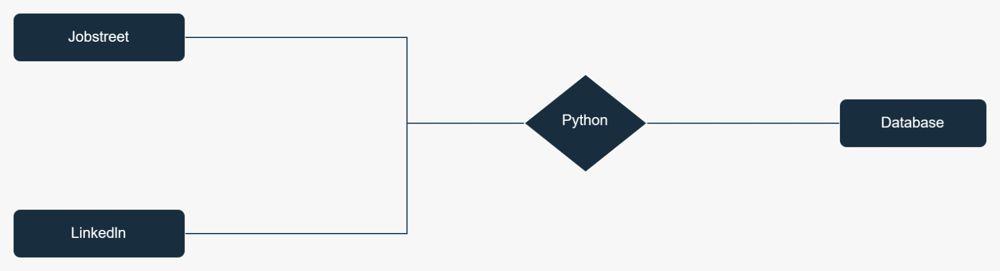

### Job-scrape

Job-scrape is a Python-based project that focuses on web scraping job data and storing it in a database. In this case, the project utilizes PostgreSQL as the database service, leveraging [ElephantSQL](https://www.elephantsql.com/) as the chosen provider.

The main objective of Job-scrape is to extract job-related information from various websites using Python's web scraping capabilities. The scraped data is then processed and stored in a PostgreSQL database for further analysis and usage.

To configure the project, you can make use of the "config.toml" file. It allows you to specify the necessary parameters, such as database connection details and scraping settings. By modifying the configuration file, you can easily adapt the project to your specific needs.

The project incorporates a flow chart, which provides an overview of the different steps involved in the job scraping process. The flow chart visually represents the sequence of actions, from initiating the scraping process to storing the acquired data in the PostgreSQL database.

By utilizing web scraping techniques and leveraging PostgreSQL as the database service, Job-scrape offers a powerful solution for collecting job-related data from various sources. This project provides a foundation for extracting valuable insights and performing analyses on the collected job data.

